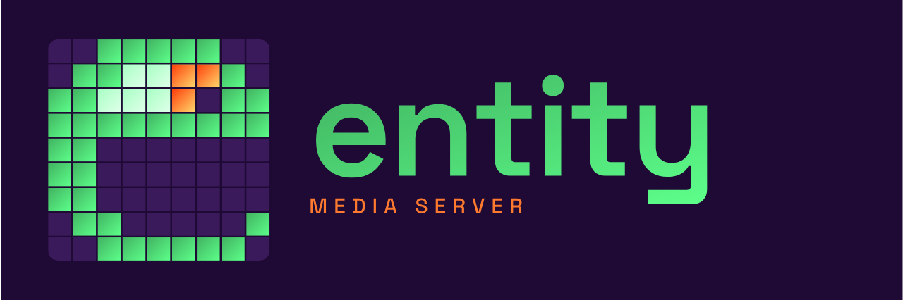

<p align="center">
  
</p>

# entity

**Frame-accurate playback and projection mapping. Open-core. Built for live shows.**

A C++ media server for projection mapping and multi-layer playback.
Multi-projector calibration, OSC control, real-time GPU compositing.
The dedicated show thread owns Present, so editor stalls don't freeze
the projector output.

[Website](https://entitymedia.art) ·
[Docs](https://entitymedia.art/docs/) ·
[GitHub](https://github.com/duremovich/Entity)

`GPLv3 core` · `Apache 2.0 plugin API` · `Windows (DX12)` · `Pre-release`

---

## Key features

- **Multi-layer playback.** Composite many video and image layers in
  real time with GPU blend modes, transparency, and frame-accurate
  scrub. Decode pipeline is per-clip and lock-free.
- **Professional codecs.** ProRes 4444 (with alpha), HAP / HAP Q / HAP
  Alpha, PNG sequences. Mixed frame rates handled natively — a 24 fps
  clip on a 60 fps timeline plays at its own rate.
- **Projection mapping.** Anchor-point calibration with a lens model,
  soft-edge blending across multi-projector arrays, persistent display
  identification by EDID.
- **Show-grade timing.** A dedicated show thread owns GPU compositing
  and output Present. Editor modals, file dialogs, and resize loops
  don't freeze the projectors.
- **OSC control.** Inbound OSC over UDP — play, pause, seek, fire
  sections, jump to cues. Pairs natively with Bitfocus Companion.
- **Projects travel.** A project is a folder. Copy it to a USB stick,
  sync to another machine — media, timeline, calibration, and settings
  move together as one tree.
- **Layered timeline.** Three layer kinds on one timeline: clip,
  object-animation (keyframe-drive screen and prop transforms),
  generative (procedural content like Muncher).
- **Per-layer effects.** Ordered shader chain on every layer with nine
  engine effects (blur, sharpen, vignette, pixelate, chromatic
  aberration, edge detect, brightness/contrast, hue/saturation,
  invert) plus a node-graph editor and HLSL effect packs for
  user-authored shaders.
- **Content routing + Feed Maps.** Route logical content to screens
  independently of how those screens reach physical outputs. Tiled
  routes split a canvas across LED panels. Feed Maps name regions on
  a source canvas and export an SVG template content creators can
  author against.

See the [feature overview](https://entitymedia.art/) and
[concept docs](https://entitymedia.art/docs/concepts/) for more.

## Status

Pre-1.0, active development. Core engine (playback, mapping, OSC,
effects, layers, content routing, plugins) is shipping and used
day-to-day. **510 / 510 ctest green** at current HEAD.

Latest shipped milestone: Content Routing library + Feed Maps
(ADR-0022, May 2026).

The editor/show thread split is complete — timeline, decode, animation,
and section scheduling all keep running on the show thread when the
editor thread stalls, so the projector output never freezes.

## Build from source

Prereqs: Visual Studio 2022 (Desktop C++), CMake 3.21+, vcpkg.

```bash
git clone https://github.com/duremovich/Entity.git
cd Entity

cmake -B build -S . \
  -DCMAKE_TOOLCHAIN_FILE=C:/vcpkg/scripts/buildsystems/vcpkg.cmake

cmake --build build --config Release

# Editor lands at:
build\bin\Release\EntityMediaEditor.exe
```

Full install guide with system requirements and troubleshooting:
[entitymedia.art/docs/getting-started/install](https://entitymedia.art/docs/getting-started/install/).

## Architecture

- **C++20 + ECS** (EnTT) + Data-Oriented Design — components are POD,
  systems iterate `view<Components...>()` for cache-friendly bulk
  processing. See [`docs/reference/ECS_PRINCIPLES.md`](docs/reference/ECS_PRINCIPLES.md).
- **D3D12** renderer on Windows. The `IRenderer` abstraction is in
  place for future Metal (macOS) and Vulkan (Linux) backends; both are
  deferred until customer demand makes the case (ADR-0001).
- **FFmpeg** decode workers per clip writing into lock-free ring
  buffers.
- **Editor / show thread split** — the editor thread is the sole
  registry writer; a dedicated show thread owns GPU compositing and
  Present. Editor stalls don't pause the projector output. See
  [`docs/adr/0014-editor-show-thread-split.md`](docs/adr/0014-editor-show-thread-split.md).
- **Plugin system** — Apache-2.0 plugin API with first-party plugins
  for OSC and bus-logging. Pro plugins live in a sibling private repo
  and link via `EXTRA_PLUGIN_DIRS`. See
  [`docs/adr/0005-open-core-dual-license.md`](docs/adr/0005-open-core-dual-license.md).
- **Tracy profiling** integrated with on-demand capture, named frame
  contexts for Editor and Show, per-system zones, and D3D12 GPU zones.
  See [`docs/adr/0015-profiling-with-tracy.md`](docs/adr/0015-profiling-with-tracy.md).

Architecture decisions live in [`docs/adr/`](docs/adr/) — start at
[`docs/adr/README.md`](docs/adr/README.md). The full ADR index covers
twenty-plus decisions spanning licensing, threading, codec strategy,
calibration math, and the layer / effects / content-routing data
models.

## Project structure

```
entity/
├── apps/editor/              Editor application
├── include/entity/           Public headers (components, systems, ...)
├── src/                      Implementation
│   ├── core/                 Engine, settings, plugin context
│   ├── render/               D3D12 renderer
│   ├── systems/              ECS systems (Decode, Compositor, ...)
│   ├── timeline/             Timeline state
│   ├── effects/              Engine effect registry
│   ├── director/             Snapshot bake, R2D/D2R bus drains
│   └── ui/                   ImGui windows
├── plugin-api/               Apache 2.0 plugin API headers
├── plugins/                  First-party plugins (osc-receiver, bus-logger)
├── shaders/                  HLSL shaders
├── tests/                    ctest suites
├── docs/
│   ├── adr/                  Architecture Decision Records
│   ├── reference/            ECS principles, system ordering, archetypes
│   └── status/               HISTORY.md + CURRENT.md pointer
└── images/                   Brand assets (logo, lockups, favicons, OG)
```

## License

- **Engine core** — GPLv3 with a linking exception. See [`LICENSE`](LICENSE).
- **Plugin API** (`plugin-api/`, `entity-bus`, `plugins/`) — Apache 2.0.
  See [`LICENSE-PLUGIN-API`](LICENSE-PLUGIN-API).
- See [`LICENSING.md`](LICENSING.md) for the dual-license explainer.

Commercial-friendly: GPLv3 obligations attach to the engine itself, not
to plugins built against the Apache-2.0 API. Running shows with entity
(without redistributing the engine) is unrestricted commercial use.

## Contributing

Pull requests welcome. The architecture context for contributors lives
in [`docs/adr/`](docs/adr/) and [`docs/reference/`](docs/reference/).

For bugs and feature ideas:
[github.com/duremovich/Entity/issues](https://github.com/duremovich/Entity/issues).

## Resources

| | |
|---|---|
| Marketing site + user docs | [entitymedia.art](https://entitymedia.art) |
| ADR index | [`docs/adr/README.md`](docs/adr/README.md) |
| ECS / DOD principles | [`docs/reference/ECS_PRINCIPLES.md`](docs/reference/ECS_PRINCIPLES.md) |
| Entity archetypes | [`docs/reference/ENTITY_ARCHETYPES.md`](docs/reference/ENTITY_ARCHETYPES.md) |
| System ordering | [`docs/reference/SYSTEM_ORDERING.md`](docs/reference/SYSTEM_ORDERING.md) |
| Troubleshooting | [`docs/reference/TROUBLESHOOTING.md`](docs/reference/TROUBLESHOOTING.md) |
| Development history | [`docs/status/HISTORY.md`](docs/status/HISTORY.md) |

---

**Tech stack** — C++20 · EnTT · D3D12 · FFmpeg · CMake / vcpkg · ImGui ·
Tracy

**Platform** — Windows 10 / 11 (DX12). macOS (Metal) and Linux
(Vulkan) on the roadmap.
